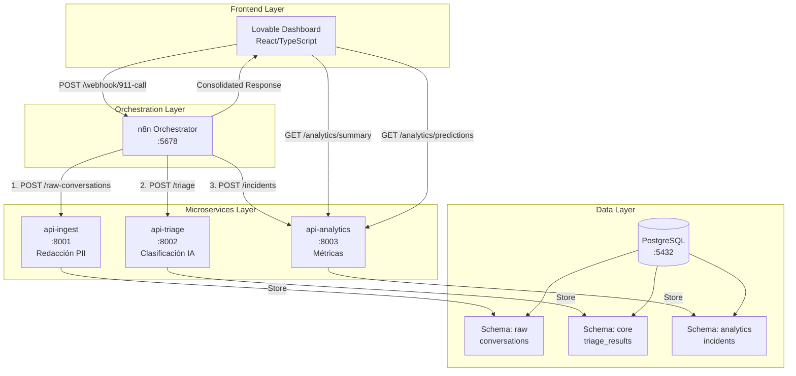
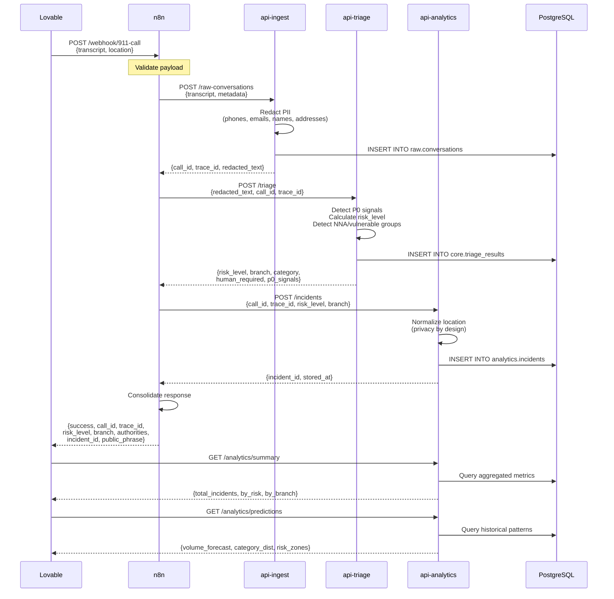
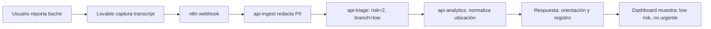
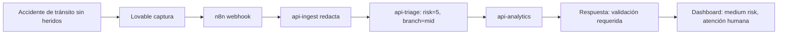
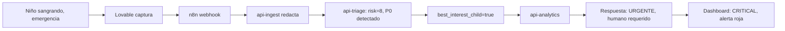

# Arquitectura del Sistema - 911 AI Flow Demo

## Descripción General

**911 AI Flow Demo** es un sistema de demostración educativa que simula el flujo de procesamiento de llamadas de emergencia 911 con asistencia de IA determinista. El sistema está diseñado con arquitectura de microservicios, orquestación mediante n8n, y almacenamiento en PostgreSQL con separación lógica de datos.

---

## Diagrama de Arquitectura General



---

## Flujo de Datos Completo



---

## Componentes del Sistema

### 1. Lovable Dashboard (Frontend)

**Tecnología:** React + TypeScript + Vite

**Responsabilidades:**
- Interfaz de usuario para simular llamadas 911
- Captura de transcript y ubicación
- Envío de llamadas al webhook n8n
- Visualización de resultados (risk_level, branch, authorities)
- Dashboard de analytics (métricas, predicciones, mapas de calor)

**Endpoints Consumidos:**
- `POST http://localhost:5678/webhook/911-call`
- `GET http://localhost:8003/analytics/summary`
- `GET http://localhost:8003/analytics/predictions`

---

### 2. n8n Orchestrator

**Tecnología:** n8n (Node.js)

**Puerto:** 5678

**Responsabilidades:**
- Recibir llamadas vía webhook POST `/webhook/911-call`
- Validar payload (transcript requerido)
- Orquestar flujo secuencial: ingest → triage → analytics
- Manejar errores y reintentos (máximo 2)
- Consolidar respuesta de los 3 servicios
- Responder al cliente con JSON unificado

**Workflow:**
```
Webhook → Validate → Ingest → Triage → Analytics → Consolidate → Respond
              ↓
          (invalid)
              ↓
        Error Response
```

**Configuración:**
- Timeouts: 10-15 segundos por servicio
- Reintentos: 2 intentos con 1 segundo de espera
- CORS: Habilitado para localhost:3000 y localhost:5678
- Autenticación: Basic Auth (admin/changeme)

---

### 3. api-ingest (Microservicio de Ingesta)

**Tecnología:** FastAPI + Python 3.11

**Puerto:** 8001

**Responsabilidades:**
- Recibir transcript original de llamada
- **Redactar PII** antes de almacenar:
  - Teléfonos → `[PHONE_REDACTED]`
  - Emails → `[EMAIL_REDACTED]`
  - Nombres propios → `[NAME_REDACTED]`
  - Direcciones con número → `[ADDRESS_REDACTED]`
- Generar `call_id` (UUID único)
- Generar `trace_id` (UUID único para trazabilidad)
- Almacenar en `raw.conversations`
- **NUNCA guardar transcript original sin redactar**

**Endpoints:**
- `POST /raw-conversations` - Ingestar nueva llamada
- `GET /raw-conversations` - Listar llamadas (paginado)
- `GET /health` - Health check

**Algoritmo de Redacción:**
```python
1. Detectar teléfonos (regex: \d{10}, \d{3}-\d{3}-\d{4})
2. Detectar emails (regex: \S+@\S+\.\S+)
3. Detectar nombres propios (heurística: palabras capitalizadas)
4. Detectar direcciones (regex: calle/avenida + número)
5. Reemplazar con tokens de redacción
6. Guardar resumen de redacción en metadata
```

---

### 4. api-triage (Microservicio de Clasificación)

**Tecnología:** FastAPI + Python 3.11

**Puerto:** 8002

**Responsabilidades:**
- Recibir texto **redactado** de api-ingest
- Detectar **señales P0** (60+ keywords críticos)
- Calcular `risk_level` (1-10)
- Determinar `branch` (low/mid/critical)
- Determinar `priority_class` (minimum/low/medium/high/critical)
- Clasificar `case_category` (security/medical/protection_civil/etc.)
- Detectar grupos vulnerables (NNA, adultos mayores, discapacidad)
- Activar `best_interest_child` si hay NNA
- Determinar `human_required` (true si risk >= 6 o P0 o NNA)
- Sugerir `primary_authority` y `support_authorities`
- Generar `public_stage_phrase` y `rationale_public`
- Almacenar en `core.triage_results`

**Endpoints:**
- `POST /triage` - Clasificar llamada
- `GET /health` - Health check

**Matriz de Riesgo:**

| Risk Level | Branch | Descripción | Acción |
|------------|--------|-------------|--------|
| 1-4 | low | Servicios públicos, orientación | Registro y seguimiento |
| 5 | mid | Accidentes sin P0, validación | Atención humana media |
| 6-10 | critical | Señales P0, NNA, emergencias | Atención humana inmediata |

**Señales P0 (Prioridad 0):**
- Armas (pistola, cuchillo, rifle)
- Fuego/Explosión (incendio, bomba, gas)
- Médico crítico (inconsciente, sangrado, no respira)
- Violencia (secuestro, violación, maltrato)
- Grupos vulnerables en peligro (niño, adulto mayor)
- Comunicación comprometida (llamada silenciosa, gritos)

**Regla Crítica:**
```
SI hay señales P0 → risk_level >= 6 SIEMPRE
SI hay NNA → best_interest_child = true
SI risk >= 6 O P0 O NNA → human_required = true
NUNCA degradar llamadas con P0
```

---

### 5. api-analytics (Microservicio de Analítica)

**Tecnología:** FastAPI + Python 3.11

**Puerto:** 8003

**Responsabilidades:**
- Recibir incidentes clasificados de api-triage
- **Normalizar ubicaciones** (privacy by design):
  - "Calle Madero 45" → "Centro"
  - "Insurgentes 123" → "Zona simulada"
- Almacenar en `analytics.incidents`
- Calcular métricas agregadas:
  - Total de incidentes
  - Distribución por risk_level
  - Distribución por branch
  - Distribución por case_category
  - Conteo de human_required
  - Conteo de P0 signals
  - Conteo de NNA involucrados
- Generar predicciones mock:
  - Volumen forecast (por hora)
  - Distribución de categorías
  - Zonas de riesgo (generalizadas)

**Endpoints:**
- `POST /incidents` - Registrar incidente
- `GET /incidents` - Listar incidentes (paginado)
- `GET /analytics/summary` - Métricas agregadas
- `GET /analytics/predictions` - Predicciones mock
- `GET /health` - Health check

**Normalización de Ubicaciones:**
```python
Entrada: "Calle Madero 45, Colonia Centro"
Proceso:
  1. Detectar colonia/alcaldía conocida → "Centro"
  2. Si tiene número de calle → "Zona simulada"
  3. Si es calle principal sin número → "Zona {calle}"
  4. Default → "Zona simulada"
Salida: "Centro"
```

---

### 6. PostgreSQL (Base de Datos)

**Tecnología:** PostgreSQL 15

**Puerto:** 5432

**Responsabilidades:**
- Almacenamiento persistente de todos los datos
- Separación lógica mediante schemas
- Vistas para consultas optimizadas
- Índices para performance

**Schemas:**

#### Schema: `raw`
**Propósito:** Datos crudos redactados

**Tabla: `conversations`**
```sql
- call_id (UUID, PK)
- trace_id (UUID, unique)
- redacted_text (TEXT) -- Texto con PII redactada
- original_transcript (TEXT) -- SIEMPRE '[NOT_STORED_PRIVACY_BY_DESIGN]'
- redaction_summary (JSONB) -- Qué se redactó
- metadata (JSONB)
- timestamp (TIMESTAMPTZ)
```

#### Schema: `core`
**Propósito:** Resultados de clasificación

**Tabla: `triage_results`**
```sql
- triage_id (UUID, PK)
- call_id (UUID, FK → raw.conversations)
- trace_id (UUID)
- risk_level (INTEGER 1-10)
- branch (TEXT: low/mid/critical)
- priority_class (TEXT)
- case_category (TEXT)
- medical_category (TEXT, nullable)
- protected_group_flags (JSONB)
- best_interest_child (BOOLEAN)
- human_required (BOOLEAN)
- primary_authority (TEXT)
- support_authorities (TEXT[])
- public_stage_phrase (TEXT)
- rationale_public (TEXT)
- trust_flags (JSONB)
- p0_signals (TEXT[])
- keywords_detected (JSONB)
- timestamp (TIMESTAMPTZ)
```

#### Schema: `analytics`
**Propósito:** Métricas y análisis

**Tabla: `incidents`**
```sql
- incident_id (UUID, PK)
- call_id (UUID, FK → raw.conversations)
- trace_id (UUID)
- risk_level (INTEGER)
- branch (TEXT)
- case_category (TEXT)
- human_required (BOOLEAN)
- has_p0_signals (BOOLEAN)
- location_hint (TEXT) -- Normalizado, no direcciones completas
- processed_at (TIMESTAMPTZ)
- timestamp (TIMESTAMPTZ)
```

**Vistas:**
- `v_risk_distribution` - Distribución de riesgo
- `v_category_trends` - Tendencias por categoría
- `v_hourly_patterns` - Patrones por hora

---

## Flujos de Casos de Uso

### Caso 1: Llamada de Bajo Riesgo (Low)



**Características:**
- risk_level: 1-4
- branch: "low"
- human_required: false
- p0_signals: []
- Acción: Registro y seguimiento no urgente

---

### Caso 2: Llamada de Riesgo Medio (Mid)



**Características:**
- risk_level: 5
- branch: "mid"
- human_required: true
- p0_signals: []
- Acción: Validación humana, prioridad media

---

### Caso 3: Llamada Crítica P0 (Critical)



**Características:**
- risk_level: 8-10
- branch: "critical"
- human_required: true
- p0_signals: ["sangrado grave", "maltrato infantil"]
- best_interest_child: true
- Acción: Atención humana INMEDIATA, prioridad máxima

---

## Principios de Diseño

### 1. Privacy by Design

- ✅ Redacción automática de PII en punto de entrada
- ✅ No almacenar transcript original
- ✅ Normalización de ubicaciones
- ✅ Minimización de datos
- ✅ Separación de datos sensibles (schemas)

### 2. Security by Default

- ✅ Servicios en 127.0.0.1 (no expuestos a internet)
- ✅ No secretos en repositorio
- ✅ Logs sin PII
- ✅ Validación de inputs
- ✅ Autenticación básica en n8n

### 3. Fail-Safe

- ✅ Señales P0 SIEMPRE elevan risk_level >= 6
- ✅ NNA SIEMPRE activa best_interest_child
- ✅ Errores no degradan clasificación
- ✅ Timeouts y reintentos configurados

### 4. Observability

- ✅ trace_id único por llamada
- ✅ Logs estructurados
- ✅ Health checks en todos los servicios
- ✅ Métricas agregadas en analytics

### 5. Scalability (Futuro)

- 🔄 Microservicios independientes (fácil escalar)
- 🔄 Stateless (fácil replicar)
- 🔄 Base de datos separada (fácil sharding)
- 🔄 n8n puede reemplazarse por Kafka/RabbitMQ

---

## Tecnologías Utilizadas

| Componente | Tecnología | Versión | Propósito |
|------------|-----------|---------|-----------|
| Frontend | Lovable (React) | - | Dashboard interactivo |
| Orchestrator | n8n | latest | Orquestación de flujo |
| Microservices | FastAPI | 0.104 | APIs REST |
| Language | Python | 3.11 | Backend logic |
| Database | PostgreSQL | 15 | Almacenamiento |
| Container | Docker | 20.10+ | Despliegue |
| Orchestration | Docker Compose | 2.0+ | Multi-container |

---

## Limitaciones del MVP

### Arquitectura

- ❌ No balanceo de carga
- ❌ No caché distribuido (Redis)
- ❌ No message queue (Kafka/RabbitMQ)
- ❌ No service mesh
- ❌ No auto-scaling

### IA

- ❌ No modelos de ML reales
- ❌ No aprendizaje automático
- ❌ Clasificación determinista (reglas fijas)
- ❌ No NLP avanzado

### Datos

- ❌ Datos 100% sintéticos
- ❌ No integración con sistemas reales
- ❌ No datos históricos reales

### Seguridad

- ❌ No encriptación end-to-end
- ❌ No WAF
- ❌ No rate limiting avanzado
- ❌ No SIEM

---

## Próximos Pasos (Futuro)

1. **Integración Real**
   - Conectar con C5 real
   - Integrar con CAD existente
   - Despacho de unidades

2. **IA Real**
   - Modelos de NLP (BERT, GPT)
   - Clasificación con ML
   - Detección de emociones

3. **Escalabilidad**
   - Kubernetes
   - Message queue
   - Caché distribuido

4. **Seguridad**
   - Encriptación E2E
   - WAF
   - SIEM

5. **Compliance**
   - Auditoría completa
   - Certificaciones
   - Revisión legal

---

**Versión:** 1.0.0  
**Fecha:** 2026-06-06  
**Autor:** Bob  
**Propósito:** Demo educativa para hackathon