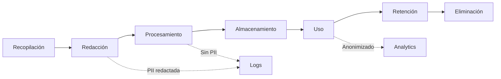

# Marco Legal y Privacidad - CENTINELA_CDMX_IA

## Aviso Importante

**Este es un sistema de demostración educativa para hackathon. NO es un sistema 911 real en producción.**

- ✅ Datos 100% sintéticos
- ✅ Propósito educativo y de evaluación técnica
- ✅ No procesa llamadas reales de emergencia
- ✅ No sustituye operadores humanos
- ✅ No conecta con sistemas C5 reales

---

## Tabla de Contenidos

1. [Naturaleza del Sistema](#naturaleza-del-sistema)
2. [Principios de Privacidad](#principios-de-privacidad)
3. [Marco Legal Mexicano](#marco-legal-mexicano)
4. [Protección de Datos Personales](#protección-de-datos-personales)
5. [Protección de Grupos Vulnerables](#protección-de-grupos-vulnerables)
6. [Derechos ARCO](#derechos-arco)
7. [Consentimiento](#consentimiento)
8. [Humano en el Loop](#humano-en-el-loop)
9. [Limitaciones y Disclaimers](#limitaciones-y-disclaimers)
10. [Recomendaciones para Producción](#recomendaciones-para-producción)

---

## Naturaleza del Sistema

### Demo Educativa

Este sistema es una **prueba de concepto (PoC)** desarrollada para:

1. **Demostrar viabilidad técnica** de clasificación automática de llamadas
2. **Evaluar arquitectura** de microservicios para emergencias
3. **Validar principios** de Privacy by Design
4. **Mostrar integración** de IA determinista con flujos 911

### NO es:

- ❌ Un sistema 911 en producción
- ❌ Un reemplazo de operadores humanos
- ❌ Una herramienta de despacho real
- ❌ Un sistema certificado para emergencias
- ❌ Una solución lista para uso con datos reales

### Datos Sintéticos

**Todos los datos utilizados son ficticios:**

- Transcripciones inventadas
- Nombres simulados
- Teléfonos falsos (formato válido, números inexistentes)
- Direcciones ficticias
- Ubicaciones generalizadas
- Métricas simuladas

**No se han procesado ni se procesarán datos reales de emergencias.**

---

## Principios de Privacidad

### 1. Privacy by Design

El sistema implementa privacidad desde el diseño, no como añadido posterior:

#### a) Minimización de Datos

**Principio:** Solo recopilar datos estrictamente necesarios.

**Implementación:**
- ✅ No se almacena transcript original sin redactar
- ✅ PII se redacta automáticamente antes de procesar
- ✅ Ubicaciones se normalizan (no direcciones completas)
- ✅ No se guardan datos biométricos
- ✅ No se guardan grabaciones de audio

**Ejemplo:**
```
Entrada: "Mi nombre es Juan Pérez, teléfono 5512345678, vivo en Calle Madero 45"
Almacenado: "[NAME_REDACTED], teléfono [PHONE_REDACTED], vivo en [ADDRESS_REDACTED]"
Ubicación: "Centro" (no "Calle Madero 45")
```

#### b) Redacción Automática de PII

**PII Redactada:**
- Teléfonos → `[PHONE_REDACTED]`
- Emails → `[EMAIL_REDACTED]`
- Nombres propios → `[NAME_REDACTED]`
- Direcciones con número → `[ADDRESS_REDACTED]`

**Proceso:**
1. Transcript llega a api-ingest
2. Se aplican regex y heurísticas
3. Se reemplaza PII con tokens
4. Se guarda solo texto redactado
5. Original se descarta (nunca se almacena)

**Campo en DB:**
```sql
original_transcript = '[NOT_STORED_PRIVACY_BY_DESIGN]'
```

#### c) Normalización de Ubicaciones

**Principio:** No exponer direcciones completas.

**Implementación:**
```python
"Calle Madero 45, Colonia Centro" → "Centro"
"Insurgentes 123" → "Zona simulada"
"Colonia Cuauhtémoc" → "Cuauhtémoc"
```

**Zonas Generalizadas:**
- Alcaldías (Centro, Cuauhtémoc, Iztapalapa, etc.)
- Zonas principales (Zona Insurgentes, Zona Reforma)
- Genérico (Zona simulada)

**Nunca se expone:**
- ❌ Calle + número
- ❌ Colonia + calle específica
- ❌ Coordenadas GPS exactas

#### d) Separación de Datos

**Schemas en PostgreSQL:**

1. **raw** - Datos redactados de entrada
   - Solo texto con PII ya redactada
   - Metadata no sensible

2. **core** - Resultados de clasificación
   - Sin transcript original
   - Solo categorías y scores

3. **analytics** - Métricas agregadas
   - Datos anonimizados
   - Ubicaciones normalizadas
   - Sin identificadores personales

### 2. Transparencia

**El sistema es transparente sobre:**

- ✅ Qué datos se recopilan (transcript, ubicación)
- ✅ Cómo se procesan (redacción, clasificación)
- ✅ Dónde se almacenan (PostgreSQL, schemas separados)
- ✅ Quién tiene acceso (solo sistema local, no expuesto)
- ✅ Cuánto tiempo se retienen (demo: indefinido, producción: definir)

**Logs sin PII:**
```
✓ "Procesando llamada con trace_id abc123"
✗ "Procesando llamada de Juan Pérez, tel 5512345678"
```

### 3. Seguridad desde el Diseño

**Controles implementados:**

- ✅ Servicios en 127.0.0.1 (no expuestos a internet)
- ✅ No secretos en repositorio (.env.example sin credenciales)
- ✅ Validación de inputs (FastAPI + Pydantic)
- ✅ Logs estructurados sin PII
- ✅ Autenticación básica en n8n

---

## Marco Legal Mexicano

### Ley Federal de Protección de Datos Personales (LFPDPPP)

**Aplicabilidad:** Este sistema, si fuera a producción, estaría sujeto a LFPDPPP.

#### Artículos Relevantes

**Art. 6 - Principios:**
- ✅ **Licitud:** Datos obtenidos con consentimiento
- ✅ **Consentimiento:** Explícito antes de procesar
- ✅ **Información:** Usuario sabe qué se hace con sus datos
- ✅ **Calidad:** Datos exactos y actualizados
- ✅ **Finalidad:** Solo para clasificación de emergencias
- ✅ **Lealtad:** No uso engañoso
- ✅ **Proporcionalidad:** Solo datos necesarios
- ✅ **Responsabilidad:** Sistema auditable

**Art. 8 - Consentimiento:**
- En producción, se requeriría consentimiento explícito
- Para emergencias 911, existe base legal (interés público)
- Aun así, se debe informar sobre el procesamiento

**Art. 9 - Datos Sensibles:**
- Salud (emergencias médicas) → Requiere consentimiento expreso
- En 911 real, existe excepción por emergencia vital
- Sistema debe minimizar recopilación de datos sensibles

**Art. 16 - Aviso de Privacidad:**
- En producción, se requiere aviso de privacidad completo
- Debe especificar: finalidad, datos recopilados, derechos ARCO

#### Cumplimiento en el MVP

| Requisito LFPDPPP | Estado en MVP | Producción |
|-------------------|---------------|------------|
| Aviso de Privacidad | ⚠️ Demo educativa | ✅ Requerido |
| Consentimiento | ⚠️ Simulado | ✅ Explícito o base legal |
| Minimización | ✅ Implementado | ✅ Mantener |
| Seguridad | ⚠️ Básica | ✅ Reforzar |
| Derechos ARCO | ⚠️ Diseño futuro | ✅ Implementar |
| Transferencias | ✅ No aplica (local) | ⚠️ Evaluar |

### Ley General de los Derechos de Niñas, Niños y Adolescentes (LGDNNA)

**Aplicabilidad:** Crítica para sistema 911 que puede involucrar menores.

#### Principios del Interés Superior del Niño

**Art. 2 - Interés Superior de la Niñez:**

El sistema implementa:

1. **Detección Automática de NNA**
   ```python
   if detect_nna(transcript):
       best_interest_child = True
       risk_level = max(risk_level, 6)  # Elevar prioridad
   ```

2. **Priorización Automática**
   - Casos con NNA NUNCA se degradan
   - Siempre requieren atención humana
   - Prioridad elevada automáticamente

3. **Protección Especial**
   - Detección de maltrato infantil (P0)
   - Detección de violencia familiar con NNA
   - Activación de autoridades especializadas (DIF, ADEVI)

**Keywords NNA:**
- niño, niña, menor, bebé, adolescente, infante
- hijo, hija, escolar, estudiante menor

**Acciones Automáticas:**
```python
if nna_involved:
    best_interest_child = True
    human_required = True
    if "maltrato" in p0_signals:
        support_authorities.append("DIF")
        support_authorities.append("ADEVI")
```

#### Art. 13 - Derecho a la Protección

**Obligaciones del Sistema:**

- ✅ Detectar situaciones de riesgo para NNA
- ✅ Priorizar atención inmediata
- ✅ Involucrar autoridades especializadas
- ✅ No degradar ni cerrar casos con NNA
- ✅ Documentar para seguimiento

**Implementación:**
```
Señal: "niño sangrando"
→ P0 detectado: "sangrado grave", "maltrato infantil"
→ best_interest_child = True
→ risk_level = 8
→ branch = "critical"
→ human_required = True
→ primary_authority = "ERUM"
→ support_authorities = ["Cruz Roja", "DIF", "ADEVI"]
```

### Ley General de Acceso de las Mujeres a una Vida Libre de Violencia

**Aplicabilidad:** Detección de violencia de género.

#### Implementación

**Detección de Violencia de Género:**
```python
GENDER_VIOLENCE_KEYWORDS = [
    "mujer golpeada", "violencia mujer", "esposo golpea",
    "pareja violenta", "feminicidio", "violencia género"
]
```

**Acciones:**
- Activar flag `gender_violence = True`
- Elevar prioridad
- Sugerir autoridades especializadas (ADEVI, Fiscalía)
- Requiere atención humana sensibilizada

**Perspectiva de Género:**
- Sistema no asume género del agresor
- Detecta patrones de violencia familiar
- Prioriza seguridad de la víctima
- Sugiere recursos especializados

---

## Protección de Datos Personales

### Datos Recopilados

#### En el MVP (Demo)

**Datos Sintéticos:**
- Transcript (texto simulado)
- Ubicación (generalizada)
- Metadata (timestamp, source)

**NO se recopila:**
- ❌ Audio real
- ❌ Datos biométricos
- ❌ Identificadores oficiales (CURP, INE)
- ❌ Datos bancarios
- ❌ Datos médicos detallados

#### En Producción (Futuro)

**Datos Necesarios:**
- Transcript de llamada (redactado)
- Ubicación aproximada (normalizada)
- Timestamp
- Clasificación de riesgo
- Autoridades sugeridas

**Datos a EVITAR:**
- ❌ Nombres completos (redactar)
- ❌ Teléfonos (redactar)
- ❌ Direcciones exactas (normalizar)
- ❌ Datos médicos sensibles (minimizar)

### Ciclo de Vida de los Datos



**Etapas:**

1. **Recopilación:** Transcript + ubicación
2. **Redacción:** PII → tokens (inmediato)
3. **Procesamiento:** Clasificación sin PII
4. **Almacenamiento:** Solo datos redactados
5. **Uso:** Clasificación y métricas
6. **Retención:** Definir política (ej: 30 días)
7. **Eliminación:** Borrado seguro

### Medidas de Seguridad

**Técnicas:**
- ✅ Redacción automática
- ✅ Normalización de ubicaciones
- ✅ Separación de schemas
- ✅ Logs sin PII
- ✅ Servicios en localhost

**Organizativas:**
- ✅ Acceso restringido
- ✅ Auditoría de logs
- ✅ Documentación de procesos
- ✅ Capacitación de personal (futuro)

**Físicas:**
- ✅ Servidor local (no cloud en demo)
- ✅ No exposición a internet
- ✅ Backups encriptados (futuro)

---

## Protección de Grupos Vulnerables

### Niñas, Niños y Adolescentes (NNA)

**Detección:**
```python
NNA_KEYWORDS = [
    "niño", "niña", "menor", "bebé", "adolescente"
]
```

**Protección:**
- ✅ `best_interest_child = True`
- ✅ Prioridad elevada automáticamente
- ✅ Nunca degradar casos con NNA
- ✅ Autoridades especializadas (DIF, ADEVI)
- ✅ Seguimiento obligatorio

### Adultos Mayores

**Detección:**
```python
ELDERLY_KEYWORDS = [
    "adulto mayor", "anciano", "abuela", "abuelo", "tercera edad"
]
```

**Protección:**
- ✅ Detección de maltrato
- ✅ Prioridad elevada si hay riesgo
- ✅ Autoridades especializadas (INAPAM)

### Personas con Discapacidad

**Detección:**
```python
DISABILITY_KEYWORDS = [
    "discapacidad", "silla de ruedas", "ciego", "sordo"
]
```

**Protección:**
- ✅ Consideraciones especiales
- ✅ Accesibilidad en respuesta
- ✅ Autoridades capacitadas

### Víctimas de Violencia

**Detección:**
- Violencia de género
- Violencia familiar
- Violencia sexual
- Trata de personas

**Protección:**
- ✅ Prioridad máxima
- ✅ Autoridades especializadas (ADEVI, Fiscalía)
- ✅ Protocolos de atención sensibilizada
- ✅ Seguimiento obligatorio

---

## Derechos ARCO

**ARCO:** Acceso, Rectificación, Cancelación, Oposición

### Estado en el MVP

⚠️ **Diseño Futuro:** El MVP no implementa ARCO completo (es demo educativa).

### Implementación Futura

#### Acceso
**Derecho:** Conocer qué datos personales se tienen.

**Implementación:**
```python
GET /api/data-subject/{trace_id}
→ Devuelve: datos redactados asociados al trace_id
```

#### Rectificación
**Derecho:** Corregir datos inexactos.

**Implementación:**
```python
PATCH /api/data-subject/{trace_id}
→ Actualiza datos (si aplica)
```

#### Cancelación
**Derecho:** Solicitar eliminación de datos.

**Implementación:**
```python
DELETE /api/data-subject/{trace_id}
→ Marca para eliminación
→ Retención mínima legal (ej: 30 días)
```

#### Oposición
**Derecho:** Oponerse al tratamiento.

**Implementación:**
```python
POST /api/data-subject/{trace_id}/oppose
→ Detiene procesamiento futuro
```

### Excepciones en Emergencias

**Base Legal:** En emergencias 911 reales, puede haber excepciones a ARCO por:
- Interés público
- Protección de vida
- Investigación de delitos

**Aun así, se debe:**
- Informar sobre el procesamiento
- Minimizar datos recopilados
- Eliminar datos cuando ya no sean necesarios

---

## Consentimiento

### En el MVP (Demo)

**Consentimiento Simulado:**
```json
{
  "solid_consent": true
}
```

**Propósito:** Demostrar flujo de consentimiento.

### En Producción (Futuro)

**Tipos de Consentimiento:**

1. **Consentimiento Implícito**
   - Al llamar al 911, se entiende consentimiento para procesar emergencia
   - Base legal: interés público, protección de vida

2. **Consentimiento Explícito**
   - Para usos secundarios (analytics, mejora del servicio)
   - Debe ser informado, específico, inequívoco

**Implementación:**
```
Operador: "Su llamada será grabada y procesada para atender su emergencia"
Usuario: [Continúa llamada] → Consentimiento implícito

Operador: "¿Autoriza uso de datos para mejorar el servicio?"
Usuario: "Sí" → Consentimiento explícito
```

**Registro:**
```sql
consent_type: 'implicit' | 'explicit'
consent_timestamp: TIMESTAMPTZ
consent_purpose: 'emergency_response' | 'service_improvement'
```

---

## Humano en el Loop

### Principio Fundamental

**El sistema NO sustituye a operadores humanos. El humano siempre está en el loop.**

### Roles del Sistema

**Sistema (IA Determinista):**
- ✅ Pre-clasificación automática
- ✅ Detección de señales P0
- ✅ Sugerencia de prioridad
- ✅ Sugerencia de autoridades

**Humano (Operador):**
- ✅ Validación final
- ✅ Decisión de despacho
- ✅ Comunicación con llamante
- ✅ Coordinación de recursos
- ✅ Seguimiento del caso

### Casos que SIEMPRE Requieren Humano

```python
human_required = True if:
    - risk_level >= 6
    - len(p0_signals) > 0
    - nna_involved == True
    - branch == "mid" or branch == "critical"
    - ambiguity_detected == True
```

**Nunca Automatizar:**
- ❌ Decisión de cerrar caso crítico
- ❌ Degradación de prioridad con P0
- ❌ Despacho de unidades
- ❌ Comunicación con víctima
- ❌ Decisiones de vida o muerte

### Transparencia con el Usuario

**El usuario debe saber:**
- ✅ Que su llamada es procesada por sistema automático
- ✅ Que un humano validará la clasificación
- ✅ Que puede solicitar hablar con operador
- ✅ Que sus datos son protegidos

**Frase Sugerida:**
```
"Su llamada está siendo clasificada automáticamente para agilizar la atención.
Un operador validará la información y coordinará la respuesta."
```

---

## Limitaciones y Disclaimers

### Limitaciones del MVP

1. **No es Sistema Real**
   - Demo educativa únicamente
   - No procesa emergencias reales
   - No conecta con C5 real

2. **Datos Sintéticos**
   - Todos los datos son ficticios
   - No se probó con llamadas reales
   - Patrones simplificados

3. **IA Simulada**
   - No usa modelos de ML reales
   - Clasificación determinista (reglas)
   - No aprende de datos

4. **Seguridad Básica**
   - No encriptación E2E
   - No certificaciones de seguridad
   - No auditoría externa

5. **Sin Integración Real**
   - No despacha unidades
   - No integra con CAD
   - No conecta con autoridades

### Disclaimers Obligatorios

**Para Demo:**
```
⚠️ AVISO IMPORTANTE:
Este es un sistema de demostración educativa con datos sintéticos.
NO es un sistema 911 real. NO procesa emergencias reales.
NO sustituye a operadores humanos. NO debe usarse en producción
sin auditoría completa de seguridad, privacidad y cumplimiento legal.
```

**Para Presentación:**
```
Este proyecto demuestra viabilidad técnica de clasificación automática
de llamadas 911 usando IA determinista y principios de Privacy by Design.
Todos los datos son ficticios. El sistema requiere validación humana
para todas las decisiones críticas.
```

---

## Recomendaciones para Producción

### Antes de Usar con Datos Reales

1. **Auditoría Legal**
   - ✅ Revisión por abogado especializado en protección de datos
   - ✅ Validación de cumplimiento con LFPDPPP
   - ✅ Validación de cumplimiento con LGDNNA
   - ✅ Elaboración de aviso de privacidad completo

2. **Auditoría de Seguridad**
   - ✅ Pentesting por tercero certificado
   - ✅ Revisión de código por expertos en seguridad
   - ✅ Implementación de controles adicionales
   - ✅ Certificaciones (ISO 27001, etc.)

3. **Validación con Autoridades**
   - ✅ Aprobación de C5 CDMX
   - ✅ Validación de protocolos con autoridades
   - ✅ Capacitación de operadores
   - ✅ Pruebas piloto controladas

4. **Implementación de ARCO**
   - ✅ Endpoints para ejercer derechos
   - ✅ Proceso de atención de solicitudes
   - ✅ Plazos de respuesta definidos
   - ✅ Documentación de procedimientos

5. **Mejoras Técnicas**
   - ✅ Encriptación end-to-end
   - ✅ Modelos de ML reales (si aplica)
   - ✅ Integración con sistemas existentes
   - ✅ Escalabilidad y alta disponibilidad

6. **Capacitación**
   - ✅ Operadores en uso del sistema
   - ✅ Personal en protección de datos
   - ✅ Equipo técnico en mantenimiento
   - ✅ Directivos en implicaciones legales

### Checklist de Cumplimiento

- [ ] Aviso de privacidad elaborado
- [ ] Consentimiento implementado
- [ ] Derechos ARCO implementados
- [ ] Medidas de seguridad reforzadas
- [ ] Auditoría legal completada
- [ ] Auditoría de seguridad completada
- [ ] Aprobación de autoridades obtenida
- [ ] Capacitación de personal completada
- [ ] Pruebas piloto exitosas
- [ ] Documentación completa
- [ ] Plan de respuesta a incidentes
- [ ] Seguro de responsabilidad civil

---

## Conclusión

Este sistema demuestra que es posible implementar **Privacy by Design** en sistemas de emergencia, protegiendo datos personales mientras se mantiene la efectividad operativa.

**Principios Clave:**
1. Minimización de datos
2. Redacción automática de PII
3. Normalización de ubicaciones
4. Protección de grupos vulnerables
5. Humano en el loop
6. Transparencia

**Para Producción:**
- Requiere auditoría legal completa
- Requiere auditoría de seguridad
- Requiere aprobación de autoridades
- Requiere implementación de ARCO
- Requiere capacitación de personal

**Recordatorio Final:**
> Este sistema NO sustituye a operadores humanos.  
> El humano siempre está en el loop para decisiones críticas.

---

**Versión:** 1.0.0  
**Fecha:** 2026-06-06  
**Autor:** Bob  
**Propósito:** Demo educativa - Hackathon  
**Marco Legal:** LFPDPPP, LGDNNA, Ley de Acceso a Vida Libre de Violencia